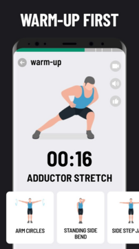
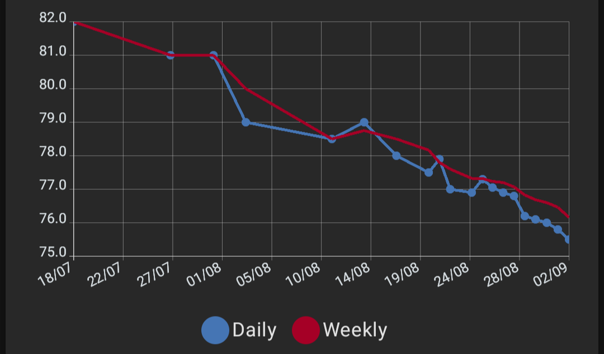

On July 18th exactly, during winter vacation, I decided I needed to do some changes to my life. I'm pretty sedentary. I've been pretty much my whole life. I was never a big exercise guy, sports guy, whatever. I liked videogames and TV. I'm just unique and quirky like that. And because of that, I gained a bit of weight. Not much (luckily, my diet wasn't that bad since my family is quite healthy), but still slightly over healthy weight. This has caused me some confidence issues, but every time I tried stuff like going to the gym, getting into a sport, or just doing exercise at home, I ended up quitting after a few weeks or less.

But this time, it was different. Less than 2 months later, I've lost ~6kg. and I now exercise about 4-5 times a week. What did I do different this time?

# Making it fun

It's no surprise to anyone that I like games. Or anything digital. So why not integrate that into my plan?

I went to the Play Store and very literally just searched "lose weight app". Basically all the results were from Leap Fitness Group, all of which had GREAT reviews (4.9 stars), and were free (with ads). I download *Lose Weight App for Men*, and it asked me some stuff about my body, then started building a plan for me. It starts with a 30-day beginner level, which grows in difficulty over time, though you can also adjust it at any time to increase/decrease it. 

_**Lose Weight App for Men** screenshot, found on Google Play_

And it worked great! Now, I'm not sure how _technically_ great it is, but it at least got me moving. One of the features I loved the most were the graphs. The app provides graphs so you can track your weight, calories burned, etc. I LOVE graphs, and it gave me so much confidence. The streak feature also helped.

At one point, I reached day 30, the final day. I was going to upgrade to the next level! It was going to be gr- Oh. It's a premium feature.

Since I stopped using it, I started just looking up YouTube videos. They're fun (I can recommend [nobadaddiction](https://www.youtube.com/@Nobadaddiction) and [Juice and Toya](https://www.youtube.com/@JuiceandToya)), but it's not the same without the other features. Luckily, I found [an app on FDroid](https://f-droid.org/packages/com.samco.trackandgraph/) that allowed me to track _whatever_, and automatically graph it. This has become a bit of an addiction for me (I'm tracking other stuff, such as sleep and mood), and it's helped me stay motivated. Which brings me to my next point:

# Tracking progress

As I said, tracking my progress has been a huge source of motivation. This is something I never did before, thinking I would feel demotivated if I didn't make much progress. And that can happen sometimes, but my main problem before was not noticing any progress, and this fixed it. Of course you wont see much progress if you just go by looks. In the long-term, you will, but in the short-term, I think having a numerical value to compare to where you started helps you see how much progress you've made.

_A graph in **Track & Graph** by Samuel Amantea-Collins_

Now, as everything, it depends on the person. I _know_ it can be hard to see the trend stabilize for a bit, or that you gained some weight since last time, for example. Weight fluctuates, a LOT, so focusing on the overall trend is more important than the individual values.

I personally (and I've heard this elsewhere, I'm not just pulling it out of my ass) like weighing myself in the morning, after going to the bathroom, and with the same (or very similar) clothes every time. It makes sense, since sleeping is the longest time you'll go without eating or doing any kind of physical activity.

I've also been using a lot more my [Garmin watch](https://www.garmin.com/en-US/p/560327/pn/010-01733-00) to track walks and other activities. I got it from my dad, and I like it because it gives me some stats and, probably the best feature of all, a map of my walk. Is that useful when I just do the same route every time? No. Is it fun every time? Hell yes.

# I love eating

Food is one of my favorite things in life. I like cooking, I love cuisine, and I adore a good piece of cheese (any piece of cheese is good). But my eating habits haven't always been the best. The _things_ I ate? Pretty good. But the _way_ I ate them? Not so much.

During this plan, I started:
- **Eating way more fruits**. I'm ashamed to say I wasn't eating almost any before, but now I crave them sometimes.
- **Taking my time with it**. I'm still a pretty fast eater, but before I used to eat more because I repeated before my body could even feel full.
- **Resisting emotional eating**. Be it because of stress, boredom, or whatever, I stopped eating when I didn't feel hungry. 

But the most important thing is, I didn't stop eating. I find most diets dumb. I know they help some people, but I feel like they often are harmful, and you end up breaking them after a bit, then feel ashamed and eat more because of it, and then you're just back to where you started. So instead, I started incorporating more vegetables into my meals, more protein, less fat, etc. And when going out with friends or family reunions I still allow myself to eat what I like, just more mindfully.

I personally don't track calories, partly because I'm lazy and forget, and partly because I just didn't like doing it.

# Other things I found useful

- Consume content about healthy habits.
- [Add, don't substract.](https://www.youtube.com/shorts/zXfKuvuRRu8?feature=share)
- You don't need equipment to do it. I just have some weights and a mat.
- It's ok to miss a day in your routine. Sometimes you're just busy, or tired. You can also just go take a walk if you don't feel like working out.

# And that's it!

Hope this is useful to anyone else. I know this is just some pretty common advice, but what'd you expect from the 17-year old gamedev? In my experience, all these tips have been great, and I'm really proud of how far I've come.