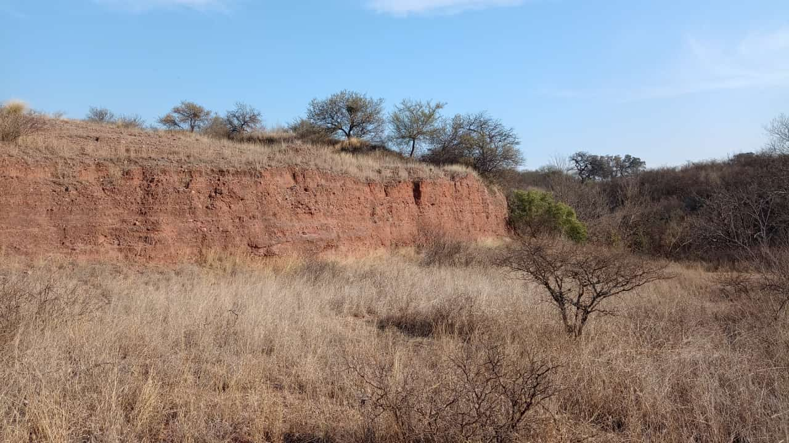
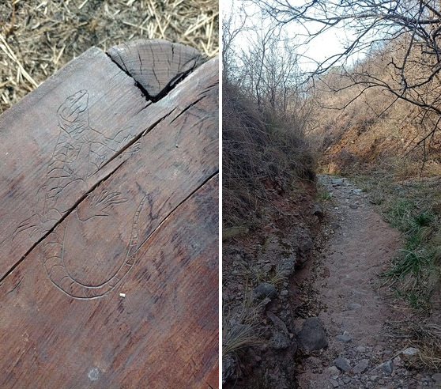

I wanted to push myself to walk an hour today, so I went to explore a nature reserve near me. Put on my headphones, pressed play on my "literally everything I like" playlist, and started walking. It ended up taking a bit longer than expected, (30 minutes longer to be exact), but it was a fun experience. First time doing it alone, too.

Here are some photos I took:

_Look at that lizard!!_

Will definitely try to do this more often. Ended up really tired though, so not for a little while. Anyways, look at this lizard(?):