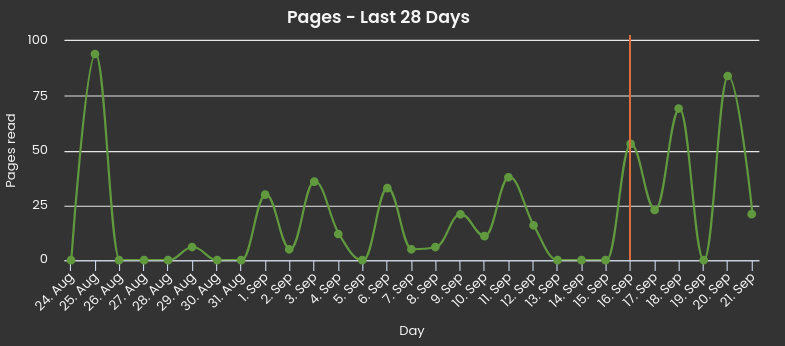
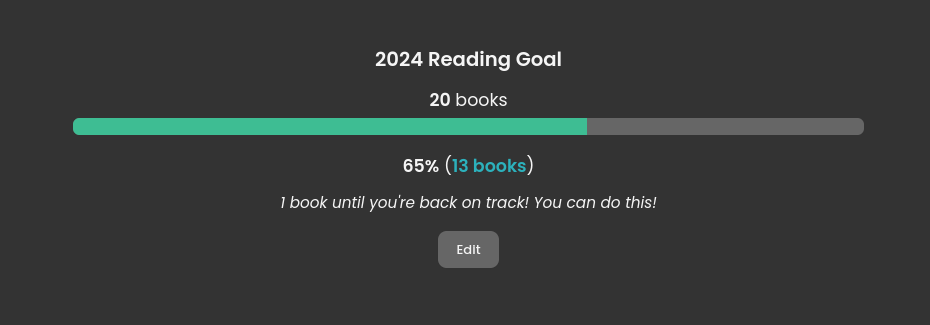

Having just finished *Como Agua para Chocolate* for school (which I REALLY enjoyed), I'm in a reading mood. I'm currently reading *Percy Jackson: The Last Olimpian*, absolutely devouring it...

_I started Percy Jackson where the orange line is. Tracked with [Storygraph](https://app.thestorygraph.com)_

...and I'm at 13 books out of the 20 I wanted to read this year. According to Storygraph, one more book (I guess this month?) and I'm back on track.

So, I wanted to lay down (some of) the books I plan on reading. Of course, if I don't like any of these books, I'll just stop reading them, so it's not a set list.

# Crónica de una Muerte Anunciada

Honestly? I know very little about this book. I know Gabriel García Márquez by name, but have not read any of his books. I just liked the title of this one, lol. It seems short, and I have a friend who hated it and one who loved it, so we'll see.

# Before the Coffee Gets Cold

I've had this one on my TBR for a while. *Como Agua para Chocolate* is a magical realism book, which is a genre that I just discovered, and looks really interesting. I love realism mixed with magical stuff, and didn't know there was a genre for it, even though I have been looking for movies and books that feature these elements.

Before the Coffee Gets Cold is also magical realism, and I've heard good stuff about it.

# Rayuela

Rayuela (Hopscotch, in english) is a classic book by argentinian author (my country!) Julio Cortázar. This book can be read in 2 ways: the "traditional" way, from chapters 1-56. And the other way starts at chapter 73 and each chapter then guides you to the next, jumping from 8 to 93, for example. This is the gimmick that interested me. I'm not sure if it'll be my style, but I still want to check it out.

# Other books

These are the main 4 books I want to read next, but other books I have in my TBR include:
- This Is How You Lose the Time War
- The Fault in Our Stars 
- Turtles All the Way Down 
- A Beautifully Foolish Endeavor 

I can't think of any more I have on my immediate to-read list. If you have any recommendations I'd appreciate them.