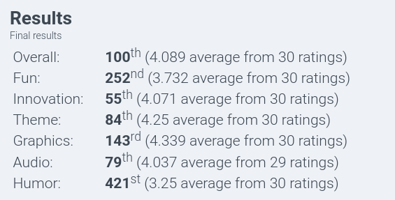

# Gamedev

This month I released 2 games for 2 game jams:

## Tiny Rexes: Professional Dinosorting

<video controls src="../../assets/images/2024-10-08-ludum-dare-56/final-gameplay.mp4" title="Title"></video>

Released for the Ludum Dare 56. It's a game about keeping tiny dinosaurs in their respective pens, with a fun twist related to colors. I talked about it [here](). It did really well, landing on overall 100th and 55th for innovation!

## Tower Up

Released for the 1-bit Jam, it also did pretty well.

I also talked about it [here](). It's a pretty simple game and there's not much to talk about, but I'm happy with it.

## Witch Game

I was originally going to release this game for Halloween, but I got both a bit burned out and too busy. I'm probably going to continue it later.

It's a game about a witch whose broom has broken down, and can only boost them for a short burst. You can use this to your advantage to jump higher or dash.

<video controls src="../../assets/images/2024-11-06-october-2024/2024-11-06_16-09-12.mp4" title="Title"></video>

# Reading

I sadly didn't read much this month. I did read Maus tho, a graphical novel about the real story of a holocaust survivor. It was heartbreaking and SO good, a must read in my opinion. The art is beautiful and graphic, but the animal characters help make it more bearable.

# Movies

What I did do this month was watch movies. A lot of them:

This month there are more short films than ever, since I usually don't watch many. (One of them being Roundhay Garden Scene, the first "film" of history). I really enjoyed Wes Anderson's ones, a director I REALLY have to watch more of. 

Other highlights include:

## Get Out

My first spooky movie of the month. Absolutely incredible. It's funny, tense, dark. It says a lot, too. I came in not knowing what to expect, except the short tag line and that it was a great movie. Definitely lived up to the hype.

## Triangle of Sadness

A very funny movie with an element that weirdly stood out to me: lingering shots. Throughout the movie there are shots that last longer than modern movies are used to, with stuff happening off-screen or far away from the camera. In conversations, we just get a reaction, sometimes, instead of the person talking. I don't know why this particularly stayed with me, but it did.

## The Wild Robot

I went to see this to the theater, my first time going alone. It was a great experience. This movie makes me so happy to see that even with all the shit happening in it, the animation industry is still given the love and respect it deserves (at least once in a while). You can tell this movie is a work of passion and I love the art style, the animation, the vfx, everything.

Also, it again confirms my theory that Dreamworks has to release like 2 bad movies before every good one. Can't wait to see what the next 2 will be. Megamind 3 when?

## Moonrise Kingdom

This is why I said I need to watch more Wes Anderson before. A weird but sweet movie, very fun to watch.

# Gaming

- I got Hi-Fi Rush!!! Been wanting to get it for a while, and I found it in a Fanatical bundle. I also got 14 Star Wars games with it but honestly I just wanted Hi-Fi Rush. Enjoying it so far, though like always I have a hard time sticking with it and sitting down to play for some reason.
- I started a Minecraft world where I built a pretty house :)

# This month in retrospect

I said "Here's to another great month!" last roundup and it was indeed a great month!