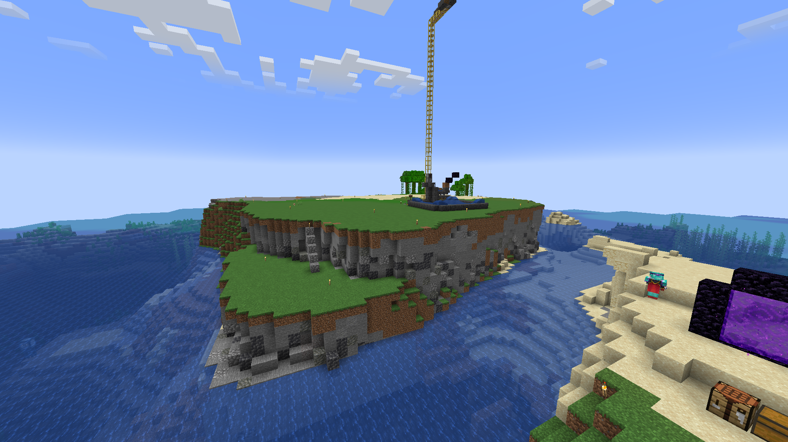

Another month is up and I didn't write anything! ...
This month I just didn't feel that motivated to write on here, plus I've been very busy with some stuff and haven't done enough gamedev. Oh well.

# Gamedev

The witch game I started making in October is still on hold as I don't know how to continue it, and I don't know if it ever will release. November was not a very gamedev-y month for me, but I did do a few things.

## Bevy

I started learning Bevy (and therefore, Rust, at the same time). It's fun! I really like the ECS structure. I think I'll stick to Godot for the time being but it was a fun experiment to get me back on the gamedev grind.

## 64x64 game in 64 minutes

[Sirmilkman](sirmilkman.com) posted in Discord that they did a 16x16 game in 16 minutes, and they nominated everyone else to try it. Then [Hairic](https://hairic.itch.io/) did a 32x32 game in 32 minutes. So the next obvious step was to make a 64x64 game in 64 minutes:

<video controls muted autoplay src="../../assets/images/2024-12-03-november-2024/64x.mp4" title="Title"></video>

It's ok. It's nothing special, just a TD game. I didn't quite get to finish how I wanted it, but still, it felt nice to get something going.

# Reading

Yeah... Much like gamedev, quite literally nothing to see here. I did start Discworld towards the end of the month (Color of Magic), and I'm enjoying it quite a bit. But still, didn't do half as much reading as I wanted to.

# Movies

Movies this month are a different story though.

I watched and rewatched a bunch of great movies this month. Highlights, as always, are:

## Aftersun

MAN. THIS FUCKING MOVIE. GOD FUCKING DAMN. I need to rewatch it one of these days, I feel like there's a lot of things you'd notice on the second rewatch. Really liked it. It's heartwarming but so sad and I don't want to spoil much but I'd recommend everyone to watch it. 

## The Edge of Seventeen

Rewatched this one and it's as great as I remember it being. Funny, witty, emotional, and the relationship between Hailee Steinfeld's and Woody Harrelson's characters is one of my favorites in movies. It's relatable, it's a fun watch, has great casting. Very rewatchable too, I noticed.

## Office Space

This one's a highlight for the wrong reasons. I've heard about this as being a comedy classic, and it has great reviews, but idk... It felt underwhelming to me. It's very funny sometimes but the rest I just felt disappointed... 

## Uncut Gems

I didn't know Adam Sandler could act...

## The Social Network

Honestly think Andrew Garfield is one of the best around, and a personal favorite of mine. He's great in here too. Also I can't believe it took me this long to watch The Social Network.

## Dead Poets Society

And speaking of taking too long to watch... 

THIS MOVIE. I know why it's a classic now. I really need to check more off my Robin Williams watch list. I can't say much that hasn't been said before. Rich gay kids.

# Gaming

This month I mostly played Minecraft, the 2-week phase's been still going strong after a month. I built a good amount of stuff, made a railway, terraformed an entire island to build farms on it, etc. Been a while since I had this much fun with Minecraft.

    

# This month in retrospect

So, this month I graduated!!! Yay!!!! It's been a fun though busy month, so I couldn't do EVERYTHING I wanted to do. But now I have a lot of free time and I hope I can spend it well.